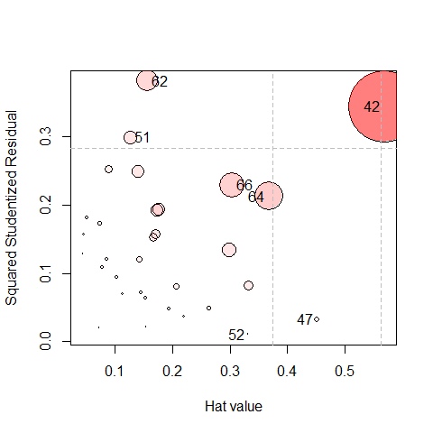

<!-- README.md is generated from README.Rmd. Please edit that file and knit again -->
[](https://cran.r-project.org/package=mvinfluence) [](https://cran.r-project.org/package=mvinfluence) [](http://www.rdocumentation.org/packages/mvinfluence)

mvinfluence
===========

**Influence Measures and Diagnostic Plots for Multivariate Linear Models**

Functions in this package compute regression deletion diagnostics for multivariate linear models and provides some associated diagnostic plots. The diagnostic measures include hat-values (leverages), generalized Cook's distance, and generalized squared 'studentized' residuals. Several types of plots to detect influential observations are provided.

Installation
------------

Get the released version from CRAN:

     install.packages("mvinfluence")

Goals
-----

The design goal for this package is that, as an extension of standard methods for univariate linear models, you should be able to fit a linear model with a multivariate response,

    mymlm <- lm( cbind(y1, y2, y3) ~ x1 + x2 + x3, data=mydata)

and then get useful diagnostics and plots with:

    influence(mymlm)
    hatvalues(mymlm)
    influencePlot(mymlm, ...)  

Examples
--------

Fit a MLM to a subset of the Rohwer data (the Low SES group).
The default influence plot (`type="stres"`) shows the squared standardized residual against the Hat value. The areas of the circles representing the observations are proportional to generalized Cook's distances.

``` r
data(Rohwer, package="heplots")
Rohwer2 <- subset(Rohwer, subset=group==2)
Rohwer.mod <- lm(cbind(SAT, PPVT, Raven) ~ n+s+ns+na+ss, data=Rohwer2)

influencePlot(Rohwer.mod, id.n=4)
```



    #>            H          Q      CookD         L          R
    #> 42 0.5682146 0.34387765 0.84671734 1.3159654 0.79640874
    #> 47 0.4516115 0.03239271 0.06339198 0.8235248 0.05906890
    #> 51 0.1264993 0.29967992 0.16427359 0.1448187 0.34307919
    #> 52 0.3324674 0.01054411 0.01519082 0.4980543 0.01579565
    #> 62 0.1571260 0.38198170 0.26008352 0.1864170 0.45318959
    #> 64 0.3672647 0.21279661 0.33866160 0.5804397 0.33631219
    #> 66 0.3042700 0.22949988 0.30259634 0.4373392 0.32986917

An alternative (`type="stres"`) plots residual components against leverage components, with the property that contours of constant Cook's distance fall on diagonal lines with slope = -1.

``` r
influencePlot(Rohwer.mod, id.n=4, type="LR")
```


    #>            H          Q      CookD         L          R
    #> 42 0.5682146 0.34387765 0.84671734 1.3159654 0.79640874
    #> 47 0.4516115 0.03239271 0.06339198 0.8235248 0.05906890
    #> 51 0.1264993 0.29967992 0.16427359 0.1448187 0.34307919
    #> 52 0.3324674 0.01054411 0.01519082 0.4980543 0.01579565
    #> 62 0.1571260 0.38198170 0.26008352 0.1864170 0.45318959
    #> 64 0.3672647 0.21279661 0.33866160 0.5804397 0.33631219
    #> 66 0.3042700 0.22949988 0.30259634 0.4373392 0.32986917
