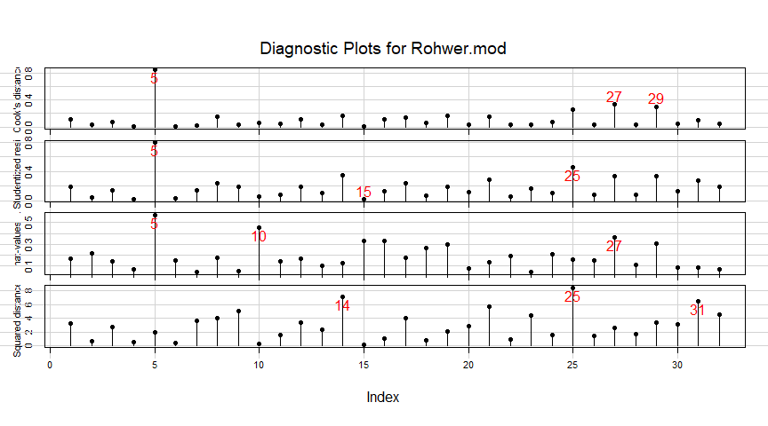

<!-- README.md is generated from README.Rmd. Please edit that file and knit again -->

[](https://cran.r-project.org/package=mvinfluence)
[](https://cran.r-project.org/package=mvinfluence)
[](https://zenodo.org/badge/latestdoi/128774860)

# mvinfluence 

**Influence Measures and Diagnostic Plots for Multivariate Linear
Models**

Functions in this package compute regression deletion diagnostics for
multivariate linear models following methods proposed by Barrett & Ling
(1992) and provide some associated diagnostic plots. The diagnostic
measures include hat-values (leverages), generalized Cook’s distance,
and generalized squared ‘studentized’ residuals. Several types of plots
to detect influential observations are provided.

In addition, the functions provide diagnostics for deletion of subsets
of observations of size `m>1`. This case is theoretically interesting
because sometimes pairs (`m=2`) of influential observations can mask
each other, sometimes they can have joint influence far exceeding their
individual effects, as well as other interesting phenomena described by
Lawrence (1995). Associated methods for the case `m>1` are still under
development in this package.

## Installation

Get the released version from CRAN:

     install.packages("mvinfluence")

## Goals

The design goal for this package is that, as an extension of standard
methods for univariate linear models, you should be able to fit a linear
model with a **multivariate** response,

    mymlm <- lm( cbind(y1, y2, y3) ~ x1 + x2 + x3, data=mydata)

and then get useful diagnostics and plots with:

    influence(mymlm)
    hatvalues(mymlm)
    cooks.distance(mymlm)
    influencePlot(mymlm, ...)  

As is done in comparable univariate functions in the `car` package,
*noteworthy* points are identified in printed output and graphs.

## Examples

Here, we fit a MLM to a subset of the Rohwer data (the Low SES group).
The default influence plot (`type="stres"`) shows the squared
standardized residual against the Hat value. The areas of the circles
representing the observations are proportional to generalized Cook’s
distances.

``` r
data(Rohwer, package="heplots")
Rohwer2 <- subset(Rohwer, subset=group==2)
rownames(Rohwer2)<- 1:nrow(Rohwer2)
Rohwer.mod <- lm(cbind(SAT, PPVT, Raven) ~ n+s+ns+na+ss, data=Rohwer2)

(infl <-influencePlot(Rohwer.mod, id.n=4, type = "stres"))
```

<!-- -->

    #>         H       Q   CookD      L       R
    #> 5  0.5682 0.34388 0.84672 1.3160 0.79641
    #> 10 0.4516 0.03239 0.06339 0.8235 0.05907
    #> 14 0.1265 0.29968 0.16427 0.1448 0.34308
    #> 15 0.3325 0.01054 0.01519 0.4981 0.01580
    #> 25 0.1571 0.38198 0.26008 0.1864 0.45319
    #> 27 0.3673 0.21280 0.33866 0.5804 0.33631
    #> 29 0.3043 0.22950 0.30260 0.4373 0.32987

The function returns (and prints) a data frame of the influence
statistics for the identified points. “Noteworthy” points are those that
are unusual on *either* Hat value (H) or the squared studentized
residual (Q), so more points will be shown than the `id.n` value. It is
often more useful to sort these in descending order by one of the
influence measures.

``` r
infl |> dplyr::arrange(desc(H))
#>         H       Q   CookD      L       R
#> 5  0.5682 0.34388 0.84672 1.3160 0.79641
#> 10 0.4516 0.03239 0.06339 0.8235 0.05907
#> 27 0.3673 0.21280 0.33866 0.5804 0.33631
#> 15 0.3325 0.01054 0.01519 0.4981 0.01580
#> 29 0.3043 0.22950 0.30260 0.4373 0.32987
#> 25 0.1571 0.38198 0.26008 0.1864 0.45319
#> 14 0.1265 0.29968 0.16427 0.1448 0.34308
```

An alternative (`type="LR"`) plots residual components against leverage
components, both on log scales. Because influence is a product of
residual \* Leverage, this plot had the property that contours of
constant Cook’s distance fall on diagonal lines with slope = -1. This
plot is often easier to read than the standard version.

``` r
influencePlot(Rohwer.mod, id.n=4, type="LR")
```

<!-- -->

    #>         H       Q   CookD      L       R
    #> 5  0.5682 0.34388 0.84672 1.3160 0.79641
    #> 10 0.4516 0.03239 0.06339 0.8235 0.05907
    #> 14 0.1265 0.29968 0.16427 0.1448 0.34308
    #> 15 0.3325 0.01054 0.01519 0.4981 0.01580
    #> 25 0.1571 0.38198 0.26008 0.1864 0.45319
    #> 27 0.3673 0.21280 0.33866 0.5804 0.33631
    #> 29 0.3043 0.22950 0.30260 0.4373 0.32987

If you wish to see how the observations fare on each of the the measures
(as well as Mahalanobis $D^2$), the `inflIndexPlot()` function gives you
index plots.

``` r
infIndexPlot(Rohwer.mod, id.n=3, id.col = "red", id.cex=1.5)
```

<!-- -->

In this example, note that while case 5 stands out as influential, it
does not have an exceptionally large $D^2$.

## Citation

To cite `mvinfluence` in publications, use:

``` r
citation("mvinfluence")
#> 
#> To cite package 'mvinfluence' in publications use:
#> 
#>   Michael Friendly (2018). mvinfluence: Influence Measures and
#>   Diagnostic Plots for Multivariate Linear Models. R package version
#>   0.8-3. https://github.com/friendly/mvinfluence
#> 
#> A BibTeX entry for LaTeX users is
#> 
#>   @Manual{,
#>     title = {mvinfluence: Influence Measures and Diagnostic Plots for Multivariate Linear
#> Models},
#>     author = {Michael Friendly},
#>     year = {2018},
#>     note = {R package version 0.8-3},
#>     url = {https://github.com/friendly/mvinfluence},
#>   }
#> 
#> ATTENTION: This citation information has been auto-generated from the
#> package DESCRIPTION file and may need manual editing, see
#> 'help("citation")'.
```

## References

Barrett, B. E. and Ling, R. F. (1992). General Classes of Influence
Measures for Multivariate Regression. *Journal of the American
Statistical Association*, **87**(417), 184-191.

Barrett, B. E. (2003). Understanding Influence in Multivariate
Regression. *Communications in Statistics – Theory and Methods*, **32**,
3, 667-680.

A. J. Lawrence (1995). Deletion Influence and Masking in Regression
*Journal of the Royal Statistical Society. Series B (Methodological)* ,
**57**, No. 1, pp. 181-189.
