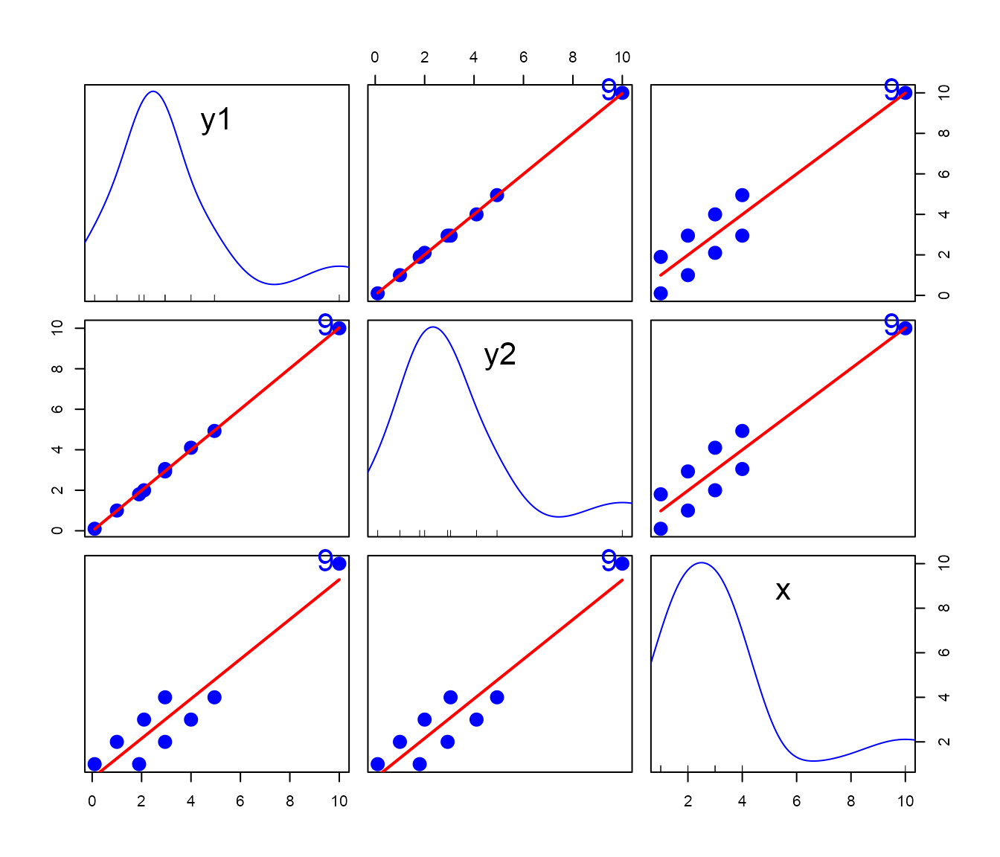
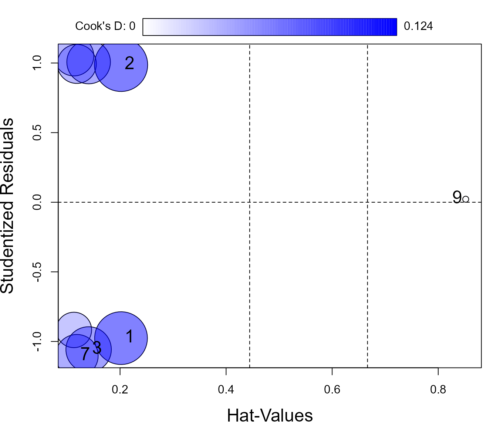
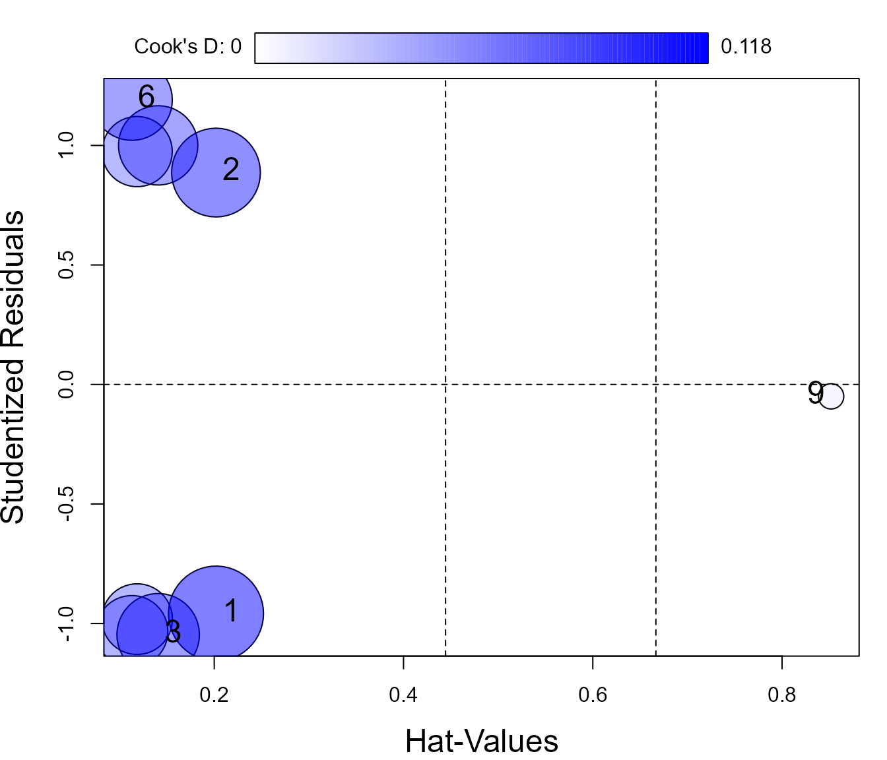
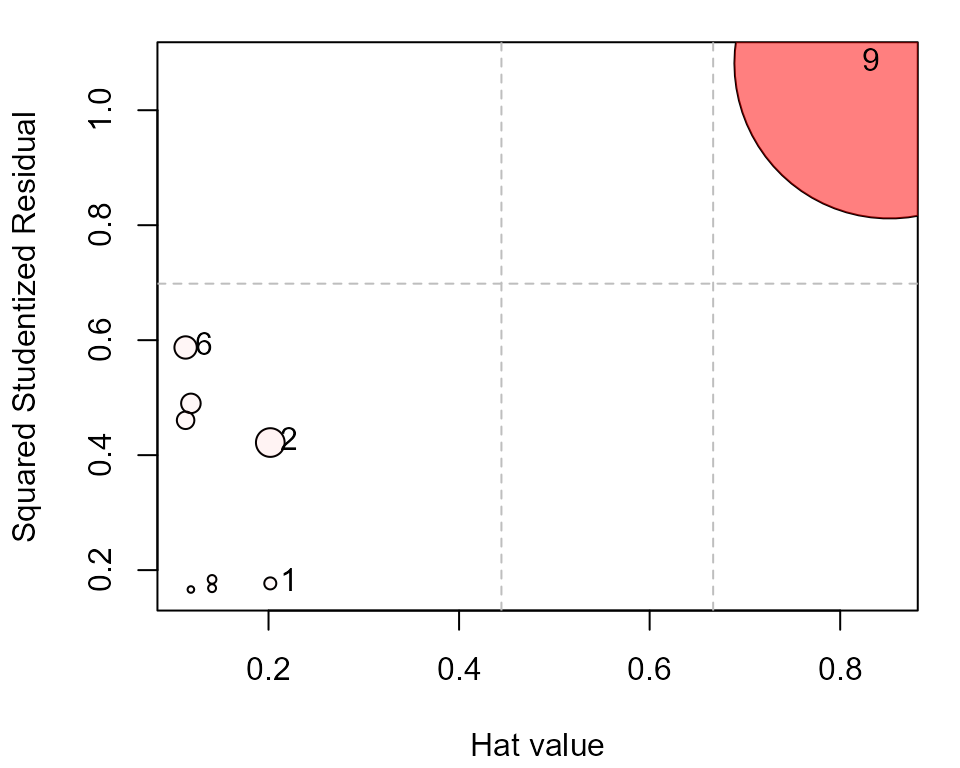
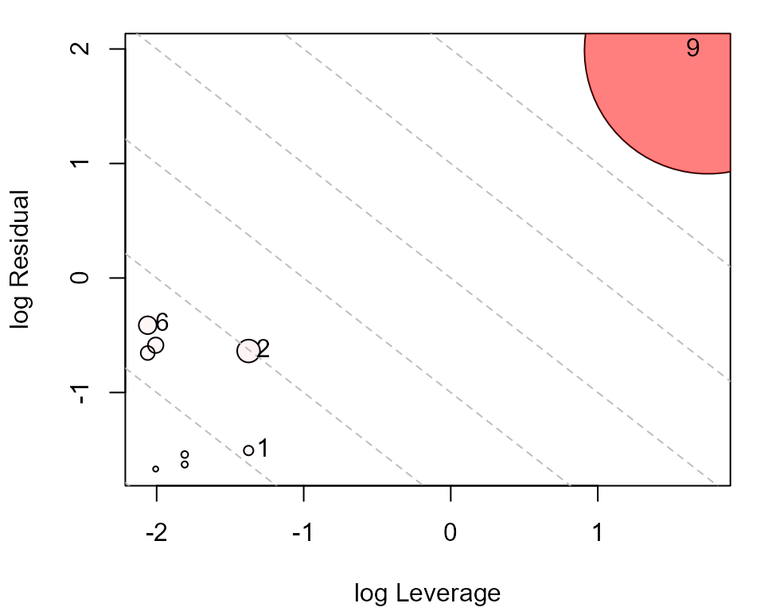
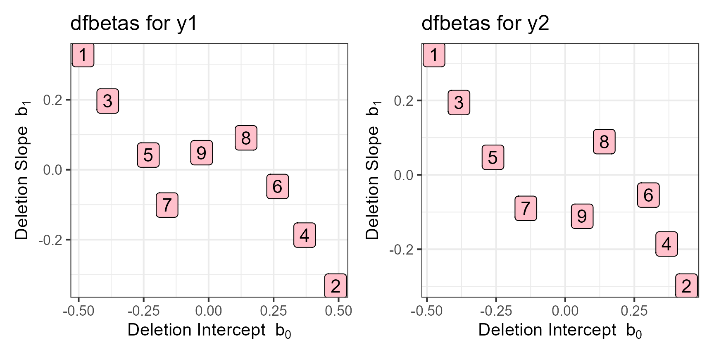
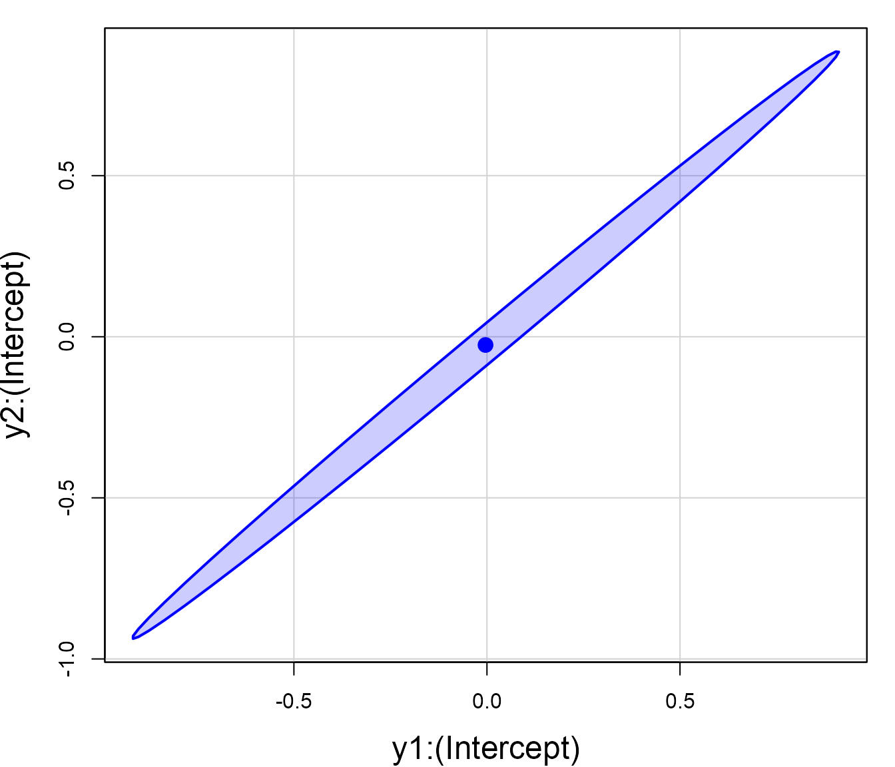
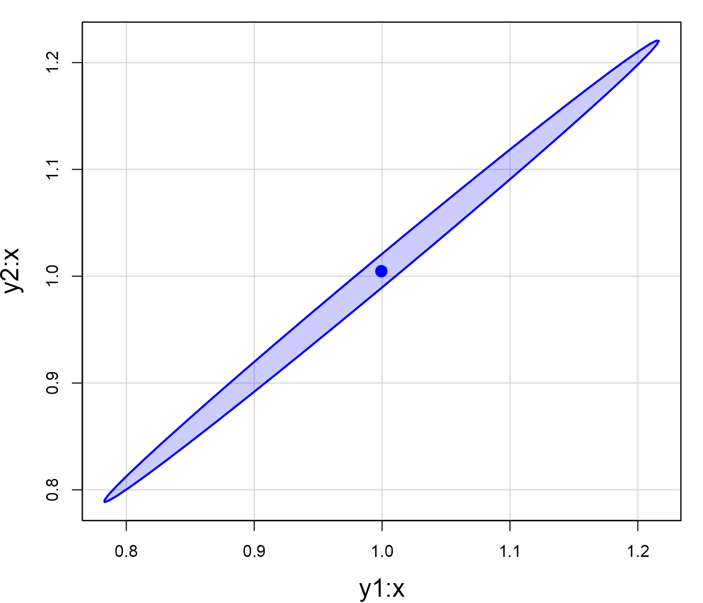
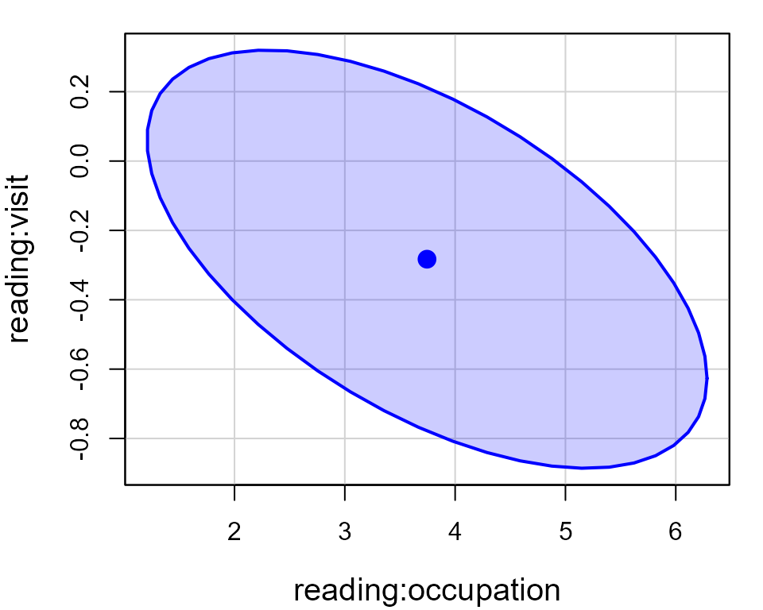
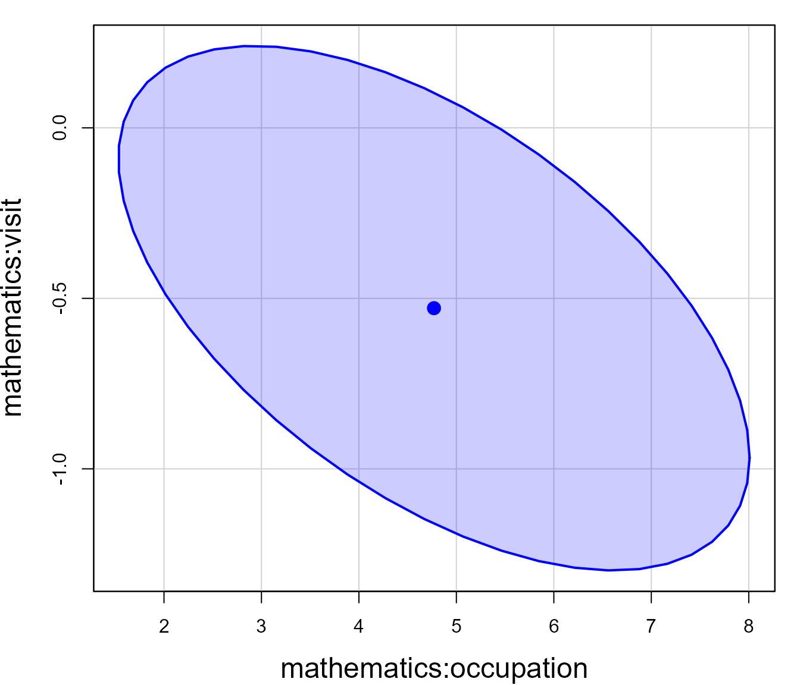

# Univariate versus Multivariate Influence

Influence measures are well-known for linear models with a single
response variable. These measures, such as Cook’s D, DFFITS and DFBETAS
assess the impact of each observation by calculating measures of the
change in regression coefficients, fitted values, etc. when that
observation is omitted from the data (Belsley, Kuh and Welsch (1980),
Cook and Weisberg (1982)).

For models with two or more response variables, the functions in the
`mvinfluence` package calculate natural extensions of the standard
measures `hatvalues`, `cooks.distance` according to the theory presented
in Barrett & Ling (1992). However, multivariate influence turns out to
be more interesting and complex than just the collection of diagnostics
for the separate responses, as this example illustrates.

### Load packages

``` r
library(tibble)      # Simple Data Frames
library(ggplot2)     # Create Elegant Data Visualisations Using the Grammar of Graphics
library(car)         # Companion to Applied Regression
library(mvinfluence) # Influence Measures and Diagnostic Plots for Multivariate Linear Models
library(patchwork)   # The Composer of Plots
library(rgl)         # 3D Visualization Using OpenGL
rgl::setupKnitr(autoprint = TRUE)    # render rgl plots in a knitr document
```

## A Toy Example

This example, from Barrett (2003), considers the simplest case, of one
predictor (`x`) and two response variables, `y1` and `y2`.

``` r
Toy <- tibble(
   case = 1:9,
   x =  c(1,    1,    2,    2,    3,    3,    4,    4,    10),
   y1 = c(0.10, 1.90, 1.00, 2.95, 2.10, 4.00, 2.95, 4.95, 10.00),
   y2 = c(0.10, 1.80, 1.00, 2.93, 2.00, 4.10, 3.05, 4.93, 10.00)
)
```

A quick peek at the data indicates that `y1` and `y2` are nearly
perfectly correlated. Both of these are linear with `x` and there is one
extreme point (case 9). Looking at these pairwise plots doesn’t suggest
that anything is terribly wrong.

``` r
car::scatterplotMatrix(~y1 + y2 + x, data=Toy, cex=2,
        col = "blue", pch = 16,
        id = list(n=1, cex=2), 
        regLine = list(lwd = 2, col="red"),
        smooth = FALSE)
```



We can view the data in 3D, using
[`car::scatter3d()`](https://rdrr.io/pkg/car/man/scatter3d.html). The
regression plane shown is that for the model `y1 ~ y2 + x`. The plot is
interactive: you can rotate and zoom using the mouse to see the views
shown in the scatterplots. If you rotate the plot so the regression
plane becomes a line, you can see that the data ellipsoid is essentially
flat.

``` r
car::scatter3d(y1 ~ y2 + x, data=Toy,
               ellipsoid = TRUE,              # show the data ellipsoid
               radius = c(rep(1,8), 2),       # make case 9 larger
               grid.col = "pink", grid.lines = 10, 
               fill = FALSE,
               id = list(n=1), offset=2
               )
rgl::rglwidget()
```

## Models

We fit the univariate models with `y1` and `y2` separately and then the
multivariate model.

``` r
Toy.lm1 <- lm(y1 ~ x, data=Toy)
Toy.lm2 <- lm(y2 ~ x, data=Toy)
Toy.mlm <- lm(cbind(y1, y2) ~ x, data=Toy)
```

Note that the coefficients in the multivariate model `Toy.mlm` are
identical to those in the separate univariate models for `y1` and `y2`.
That is,
$\mathbf{B} = \left\lbrack \mathbf{b}_{\mathbf{y}\mathbf{1}},\mathbf{b}_{\mathbf{y}\mathbf{2}} \right\rbrack$,
as if the univariate models were fit individually.

``` r
coef(Toy.lm1)
#> (Intercept)           x 
#>   -0.003704    0.999444

coef(Toy.lm2)
#> (Intercept)           x 
#>    -0.02556     1.00467

coef(Toy.mlm)
#>                    y1       y2
#> (Intercept) -0.003704 -0.02556
#> x            0.999444  1.00467
```

However, the test for predictors differ, because the multivariate tests
take the correlation between `y1` and `y2` into account.

``` r
car::Anova(Toy.lm1)
#> Anova Table (Type II tests)
#> 
#> Response: y1
#>           Sum Sq Df F value  Pr(>F)    
#> x           59.9  1    57.2 0.00013 ***
#> Residuals    7.3  7                    
#> ---
#> Signif. codes:  0 '***' 0.001 '**' 0.01 '*' 0.05 '.' 0.1 ' ' 1

car::Anova(Toy.lm2)
#> Anova Table (Type II tests)
#> 
#> Response: y2
#>           Sum Sq Df F value  Pr(>F)    
#> x           60.6  1    58.1 0.00012 ***
#> Residuals    7.3  7                    
#> ---
#> Signif. codes:  0 '***' 0.001 '**' 0.01 '*' 0.05 '.' 0.1 ' ' 1

car::Anova(Toy.mlm)
#> 
#> Type II MANOVA Tests: Pillai test statistic
#>   Df test stat approx F num Df den Df Pr(>F)   
#> x  1     0.893     25.1      2      6 0.0012 **
#> ---
#> Signif. codes:  0 '***' 0.001 '**' 0.01 '*' 0.05 '.' 0.1 ' ' 1
```

### Cook’s D

First, let’s examine the Cook’s D statistics for the models. Note that
the function
[`cooks.distance()`](https://rdrr.io/r/stats/influence.measures.html)
invokes
[`stats::cooks.distance.lm()`](https://rdrr.io/r/stats/influence.measures.html)
for the univariate response models, but invokes
[`mvinfluence::cooks.distance.mlm()`](http://friendly.github.io/mvinfluence/reference/cooks.distance.mlm.md)
for the multivariate model.

The only thing remarkable here is for case 9: The univariate Cook’s Ds,
`D1` and `D2` are very small, yet the multivariate statistic, `D12` is
over 10 times the next smallest value.

``` r
df <- Toy
df$D1  <- cooks.distance(Toy.lm1)
df$D2  <- cooks.distance(Toy.lm2)
df$D12 <- cooks.distance(Toy.mlm)

df
#> # A tibble: 9 × 7
#>    case     x    y1    y2      D1      D2    D12
#>   <int> <dbl> <dbl> <dbl>   <dbl>   <dbl>  <dbl>
#> 1     1     1  0.1   0.1  0.121   0.118   0.125 
#> 2     2     1  1.9   1.8  0.124   0.103   0.298 
#> 3     3     2  1     1    0.0901  0.0886  0.0906
#> 4     4     2  2.95  2.93 0.0829  0.0819  0.0831
#> 5     5     3  2.1   2    0.0548  0.0673  0.182 
#> 6     6     3  4     4.1  0.0692  0.0852  0.232 
#> 7     7     4  2.95  3.05 0.0793  0.0651  0.203 
#> 8     8     4  4.95  4.93 0.0665  0.0643  0.0690
#> 9     9    10 10    10    0.00159 0.00830 3.22
```

We can see how case 9 stands out in the influence plots. It has an
extreme hat value, but, because it’s residual is very small, it does not
have much influence on the fitted models for either `y1` or `y2`.
Neither of these plots suggest that anything is terribly wrong with the
univariate models.

``` r
ip1 <- car::influencePlot(Toy.lm1, id = list(cex=1.5), cex.lab = 1.5)
ip2 <- car::influencePlot(Toy.lm2, id = list(cex=1.5), cex.lab = 1.5)
```



Contrast these results with what we get for the model for `y1` and `y2`
jointly. In the multivariate version, `influencePlot.mlm` plots the
squared studentized residual (denoted `Q` in the output) against the hat
value. Case 9 stands out as wildly influential.

``` r
influencePlot(Toy.mlm, id.n=2)
```



    #>        H      Q  CookD      L      R
    #> 1 0.2019 0.1769 0.1250 0.2529 0.2216
    #> 2 0.2019 0.4219 0.2981 0.2529 0.5286
    #> 6 0.1130 0.5873 0.2322 0.1273 0.6621
    #> 9 0.8519 1.0816 3.2249 5.7500 7.3010

An alternative form of the multivariate influence plot uses the leverage
(`L`) and residual (`R`) components. Because influence is the product of
leverage and residual, a plot of $\log(L)$ versus $\log(R)$ has the
attractive property that contours of constant Cook’s distance fall on
diagonal lines with slope = -1. Adjacent reference lines represent
constant *multiples* of influence.

``` r
influencePlot(Toy.mlm, id.n=2, type = 'LR')
```



### DFBETAS

The DFBETAS statistics give the estimated change in the regression
coefficients when each case is deleted in turn. We can gain some insight
as to why case 9 is unremarkable in the univariate regressions by
plotting these. The values come from
[`stats::dfbetas`](https://rdrr.io/r/stats/influence.measures.html) and
return the standardized values.

``` r
db1 <- as.data.frame(dfbetas(Toy.lm1))
gg1 <- ggplot(data = db1, aes(x=`(Intercept)`, y=x, label=rownames(db1))) +
  geom_point(size=1.5) +
  geom_label(size=6, fill="pink") +
  xlab(expression(paste("Deletion Intercept  ", b[0]))) +
  ylab(expression(paste("Deletion Slope  ", b[1]))) +
  ggtitle("dfbetas for y1") +
  theme_bw(base_size = 16)

db2 <- as.data.frame(dfbetas(Toy.lm2))
gg2 <- ggplot(data = db2, aes(x=`(Intercept)`, y=x, label=rownames(db2))) +
  geom_point(size=1.5) +
  geom_label(size=6, fill="pink") +
  xlab(expression(paste("Deletion Intercept  ", b[0]))) +
  ylab(expression(paste("Deletion Slope  ", b[1]))) +
  ggtitle("dfbetas for y2") +
  theme_bw(base_size = 16)

gg1 + gg2
```



The values for case 9 are nearly (0, 0) in both plots, indicating that
deleting this case has negligible effect in both univariate regressions.

## What happended here?

This example was contrived to show a situation where no cases were
influential in the univariate models, but case 9 appeared very
influential in the multivariate model. Why did this happen?

My colleague, John Fox, pointed out that the problem arose from the very
high correlation between `y1` and `y2`:

``` r
with(Toy, cor(y1, y2))
#> [1] 0.9997
```

As a consequence, the covariance matrix of the multivariate regression
coefficient vector is very ill-conditioned as can be seen by converting
the covariance matrix to correlations:

``` r
(corr <- cov2cor(vcov(Toy.mlm)))
#>                y1:(Intercept)    y1:x y2:(Intercept)    y2:x
#> y1:(Intercept)         1.0000 -0.7906         0.9973 -0.7885
#> y1:x                  -0.7906  1.0000        -0.7885  0.9973
#> y2:(Intercept)         0.9973 -0.7885         1.0000 -0.7906
#> y2:x                  -0.7885  0.9973        -0.7906  1.0000
```

This appear in the correlations between the two intercept terms
`{y1,y2}:(Intercept)` and the two slope terms, `{y1,y2}:x`, and can be
visualized by confidence ellipses for pairs of these parameters:

``` r
par(mar = c(4, 4, 1, 1)+.1)
car::confidenceEllipse(Toy.mlm, which=c(1,3), levels = 0.68,
                       xlab = row.names(corr)[1], 
                       ylab=row.names(corr)[3],
                       fill = TRUE, fill.alpha = 0.2,
                       cex.lab = 1.5)

car::confidenceEllipse(Toy.mlm, which=c(2,4), levels = 0.68,
                       xlab = row.names(corr)[2], 
                       ylab=row.names(corr)[4],
                       fill = TRUE, fill.alpha = 0.2,
                       cex.lab = 1.5)
```



Although each of the `y1` and `y2` values for the high-leverage cases
are in-line with the univariate regressions (and thus have small
univariate Cook’s Ds), the ill-conditioning magnifies small
discrepancies in their positions, making the multivariate Cook’s D
larger.

## Comparing Coefficients

Beyond the ill-conditioning diagnosis above, it’s often useful to ask
more general questions of a fitted `mlm`:

- how do the coefficients relate to each other?
- which show large effects?

Two functions answer two different versions of this question:

- [`car::confidenceEllipse()`](https://rdrr.io/pkg/car/man/Ellipses.html)[¹](#fn1)
  fixes a pair of *coefficients* in a multivariate linear model as the
  plot axes.
- [`heplots::coefplot()`](https://friendly.github.io/heplots/reference/coefplot.html)
  fixes a pair of *responses* and overlays one ellipse per predictor.

We illustrate both with the `schooldata` data from the `heplots` package
– a model with three response variables (`reading`, `mathematics`,
`selfesteem`) and several predictors related to the parents and teachers
of the students.

``` r
data(schooldata, package = "heplots")
school.mod <- lm(cbind(reading, mathematics, selfesteem) ~
                    education + occupation + visit + counseling + teacher,
                  data = schooldata)
coef(school.mod)
#>              reading mathematics selfesteem
#> (Intercept) -0.17935     -0.3661   -0.04135
#> education    0.20271      0.1102   -0.04482
#> occupation   3.74507      4.7702    2.22723
#> visit       -0.28301     -0.5288    0.19456
#> counseling  -0.09146      0.1425   -0.05625
#> teacher     -0.18094     -0.3413    0.01055
```

### `car::confidenceEllipse()`

[`car::confidenceEllipse()`](https://rdrr.io/pkg/car/man/Ellipses.html)
shows the joint confidence region for two coefficients *within* one
response equation. The `occupation` and `visit` coefficients turn out to
be negatively correlated in both the `reading` and `mathematics`
equations, and `occupation`’s much larger scale echoes what we’re about
to see in the
[`coefplot()`](https://friendly.github.io/heplots/reference/coefplot.html)
figure below:

``` r
car::confidenceEllipse(school.mod, which.coef = c(3, 4),
                        fill = TRUE, fill.alpha = 0.2, cex.lab = 1.5)
car::confidenceEllipse(school.mod, which.coef = c(9, 10),
                        fill = TRUE, fill.alpha = 0.2, cex.lab = 1.5)
```



The indexing by `which.coef()` is a bit confusing here. `which.coef`
does *not* index into the table given by
[`coef()`](https://rdrr.io/r/stats/coef.html) directly. Internally,
[`confidenceEllipse()`](https://rdrr.io/pkg/car/man/Ellipses.html) works
with `vcov(school.mod)`, whose row/column names are formed by stacking
the coefficient table’s columns end-to-end, one response at a time – all
6 predictor rows for `reading` first, then all 6 for `mathematics`, then
`selfesteem`:

``` r
rownames(vcov(school.mod))
#>  [1] "reading:(Intercept)"     "reading:education"      
#>  [3] "reading:occupation"      "reading:visit"          
#>  [5] "reading:counseling"      "reading:teacher"        
#>  [7] "mathematics:(Intercept)" "mathematics:education"  
#>  [9] "mathematics:occupation"  "mathematics:visit"      
#> [11] "mathematics:counseling"  "mathematics:teacher"    
#> [13] "selfesteem:(Intercept)"  "selfesteem:education"   
#> [15] "selfesteem:occupation"   "selfesteem:visit"       
#> [17] "selfesteem:counseling"   "selfesteem:teacher"
```

So `which.coef` is a position in *this* list, counting straight through:
with 6 predictor rows per response, position
`6 * (response number - 1) + row number` in the coefficient table above.
`occupation` and `visit` are rows 3 and 4, so for `reading` (the 1st
response) they land at positions 3 and 4 – `which.coef = c(3, 4)`; for
`mathematics` (the 2nd response) the same two predictors shift by
`6 * (2-1) = 6`, landing at positions 9 and 10 –
`which.coef = c(9, 10)`.

### `heplots::coefplot()`

[`heplots::coefplot()`](https://friendly.github.io/heplots/reference/coefplot.html)
instead compares predictors *across* two responses – here `reading` vs.
`mathematics`, for three predictors – showing that `occupation` moves
both scores together substantially, while `visit` and `counseling`
barely move either.

In additon,
[`coefplot()`](https://friendly.github.io/heplots/reference/coefplot.html)
shows the univariate confidence intervals for each parameter, and dashed
lines at (0,0) so you can judge the importance of each predictor to the
multivariate model for that pair of responses.

``` r
heplots::coefplot(school.mod, variables = c("reading", "mathematics"),
                   parm = c("occupation", "visit", "counseling"),
                   fill = TRUE, lwd = 2, cex.lab = 1.25,
                   main = "Predictor effects: reading vs. mathematics")
```


Use [`confidenceEllipse()`](https://rdrr.io/pkg/car/man/Ellipses.html)
when comparing two specific coefficients; use
[`coefplot()`](https://friendly.github.io/heplots/reference/coefplot.html)
when comparing a predictor’s effect across responses.

## References

Barrett, B. E. and Ling, R. F. (1992). General Classes of Influence
Measures for Multivariate Regression. *Journal of the American
Statistical Association*, **87**(417), 184-191.

Barrett, B. E. (2003). Understanding Influence in Multivariate
Regression. *Communications in Statistics – Theory and Methods*, **32**,
3, 667-680.

Belsley, D. A., Kuh, E. and Welsch, R. E. (1980). *Regression
Diagnostics*. New York: Wiley.

Cook, R. D. and Weisberg, S. (1982). *Residuals and Influence in
Regression*. London: Chapman and Hall.

Lawrence, A. J. (1995). Deletion Influence and Masking in Regression.
*Journal of the Royal Statistical Society. Series B (Methodological)* ,
**57**, No. 1, pp. 181-189.

------------------------------------------------------------------------

1.  As of this writing,
    [`car::confidenceEllipse.mlm()`](https://rdrr.io/pkg/car/man/Ellipses.html)
    has a bug when `which.coef` is given as character names for an `mlm`
    object: it correctly subsets
    [`vcov()`](https://rdrr.io/r/stats/vcov.html) by name, but the
    coefficient *center* lookup uses unnamed indexing into the
    coefficient matrix and silently returns `NA`, causing a “need finite
    ‘xlim’ values” error. Use numeric indices instead, as below, until
    this is fixed upstream.
